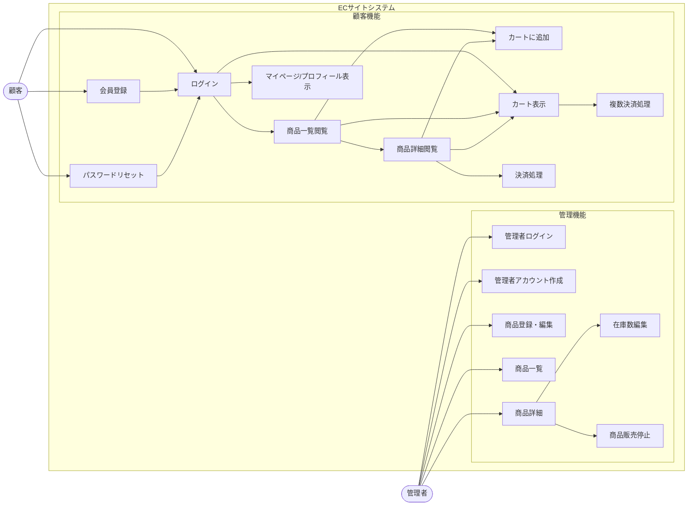

```mermaid
flowchart LR
    %% アクターの定義
    Customer(["顧客"])
    Admin(["管理者"])
    
    subgraph "ECサイトシステム"
        %% 管理者側の機能
        subgraph "管理機能"
            AdminLogin["管理者ログイン"]
            CreateAdminAccount["管理者アカウント作成"]
            ManageProducts["商品登録・編集"]
            ViewProductsList["商品一覧"]
            ViewProductDetails["商品詳細"]
            ManageInventory["在庫数編集"]
            StopSell["商品販売停止"]
        end

        %% 顧客側の機能
        subgraph "顧客機能"
            Login["ログイン"]
            Register["会員登録"]
            ResetPassword["パスワードリセット"]
            ViewProducts["商品一覧閲覧"]
            ViewProductDetail["商品詳細閲覧"]
            AddToCart["カートに追加"]
            ViewCart["カート表示"]
            Checkout["決済処理"]
            MultipleCheckout["複数決済処理"]
            ViewProfile["マイページ/プロフィール表示"]
        end
    end
    
    %% 顧客の関連
    Customer --> Login
    Customer --> Register
    Customer --> ResetPassword
    
    %% 管理者の関連
    Admin --> AdminLogin
    Admin --> CreateAdminAccount
    Admin --> ManageProducts
    Admin --> ViewProductsList
    Admin --> ViewProductDetails
    
    %% 機能間の関連
    Login --> ViewProfile
    Login --> ViewCart
    Login --> ViewProducts
    Register --> Login
    ResetPassword --> Login
    ViewProducts --> ViewProductDetail
    ViewProducts --> AddToCart
    ViewProducts --> ViewCart
    ViewProductDetail --> AddToCart
    ViewProductDetail --> Checkout
    ViewProductDetail --> ViewCart
    ViewCart --> MultipleCheckout
    ViewProductDetails --> ManageInventory
    ViewProductDetails --> StopSell
```