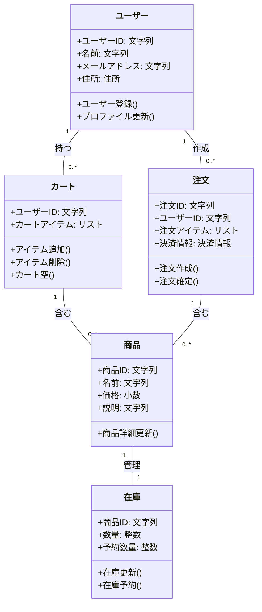

```mermaid
classDiagram
    class ユーザー {
        +ユーザーID: 文字列
        +名前: 文字列
        +メールアドレス: 文字列
        +住所: 住所
        +ユーザー登録()
        +プロファイル更新()
    }
    
    class 商品 {
        +商品ID: 文字列
        +名前: 文字列
        +価格: 小数
        +説明: 文字列
        +商品詳細更新()
    }
    
    class 在庫 {
        +商品ID: 文字列
        +数量: 整数
        +予約数量: 整数
        +在庫更新()
        +在庫予約()
    }
    
    class カート {
        +ユーザーID: 文字列
        +カートアイテム: リスト
        +アイテム追加()
        +アイテム削除()
        +カート空()
    }
    
    class 注文 {
        +注文ID: 文字列
        +ユーザーID: 文字列
        +注文アイテム: リスト
        +決済情報: 決済情報
        +注文作成()
        +注文確定()
    }
    
    ユーザー "1" -- "0..*" カート: 持つ
    ユーザー "1" -- "0..*" 注文: 作成
    商品 "1" -- "1" 在庫: 管理
    カート "1" -- "0..*" 商品: 含む
    注文 "1" -- "0..*" 商品: 含む
```